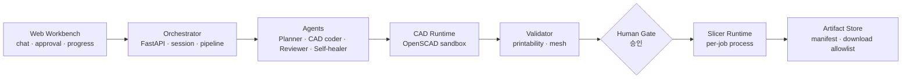

# Model Forge

> **AI-assisted 3D printing workflow orchestration prototype** — 자연어/레시피 기반 CAD 생성, 검증, 사용자 승인, 슬라이싱, 아티팩트 추적을 하나의 typed workflow로 연결하는 방법을 탐색하는 기술 프로토타입입니다.

*(공개 포트폴리오용 큐레이션 판입니다. 상용화·수익·특정 회사·장비 관련 서술은 의도적으로 제외했습니다.)*

**한눈에 보는 결과**

| 항목 | 내용 |
|---|---|
| 검증된 E2E 흐름 | 실제 채팅 UI 입력 → CAD(OpenSCAD) 생성 → 검증 → 승인 → 슬라이싱 → STL/3MF/G-code + manifest 다운로드. **4사이클 4/4 완주 · mock 0건** |
| 파이프라인 통제 | 사람 승인 게이트(go/no-go) + fail-fast (runtime 미설정 시 mock silent fallback 금지) |
| 아티팩트 계약 | manifest 기반 추적 + 다운로드 allowlist (path traversal 방지 경계 문서화) |
| 구조 | FastAPI orchestrator + Next.js workbench, 역할별 Agent(Planner·CAD coder·Reviewer·Self-healer) |
| 교체 가능 경계 | LLM / CAD / validator / slicer가 adapter + factory + typed schema로 분리 |
| 실행 격리 | OpenSCAD·slicer runtime을 외부 의존성으로 분리 (바이너리 vendoring 없음). Docker sandbox 경계는 구현돼 있으나 **이 배포에서는 live 검증하지 않고 위험수용으로 종결** |
| 생성 품질 | **측정했고, 개선 레버는 효과가 없었습니다.** 아래 별도 절 |

## 왜 만들었나

"LLM이 CAD 코드를 생성한다"까지는 쉽습니다. 어려운 것은 그 출력이 **실제 프린트 가능한 산출물**이 되기까지의
검증·승인·추적 경계를 설계하는 일입니다. Model Forge는 생성 결과를 그대로 신뢰하지 않고,
validation 노드와 사람 승인 게이트를 통과한 것만 슬라이서로 넘기는 **통제된 파이프라인**을 프로토타입으로 검증합니다.

## 아키텍처

계층 간 결합은 공개 REST/WebSocket 계약과 typed schema로만 — 특정 벤더 runtime은 adapter 뒤에 숨습니다.

## 관통 검증 — 실제 제품 경로로 4사이클

스크립트가 파이프라인을 직접 호출하는 것이 아니라, **실제 브라우저로 채팅창에 한국어를 입력해** 완주시켰습니다.

| | |
|---|---|
| 결과 | **4/4 완주 · 총 622.5초 · 명료화 왕복 0회 · 실패 0건** |
| 실행 조건 | 실 LLM(claude/opus) · OpenSCAD 2021.01 · 슬라이서 0.2.0 · **mock 0건** |
| 경로 | 채팅 한 줄 → Planner → CAD Coder → OpenSCAD → STL → Validator → Slicer → G-code |

⭐ **다섯 번 시도해 네 번 실패했고, 그 실패들이 더 값어치 있었습니다.**
1차 시도는 실행 설정 하나가 빠진 상태에서 **fail-closed 규칙이 즉시 거부**했습니다.
그 규칙이 없어 조용히 mock으로 떨어졌다면 **mock으로 4사이클을 찍고 "제품이 관통된다"고 보고할 뻔했습니다.**
나머지 실패는 값 없는 요청에 제품이 옳게 되물은 것, 세션 이어받기 미지원(아래), 타임아웃 상한 부족이었습니다.

## 생성 품질을 측정하려다 알게 된 것

파이프라인이 관통한다는 것과 결과물이 쓸 만하다는 것은 다릅니다. 전자는 증명했고, 후자는 증명하지 못했습니다.
그것을 **추측이 아니라 측정으로** 확인했습니다.

**① 지표가 실패를 표현하지 못했습니다.** 초기 지표는 함정 케이스를 넣은 뒤에도 한 번도 만점 아래로
내려간 적이 없었습니다. 올라갈 여지가 없는 지표로는 개선을 말할 수 없습니다.
그래서 개선 레버를 붙이기 전에 **실패가 관측되는 케이스셋과 지표부터** 다시 만들었습니다.

**② 자동 판정이 사람 판정보다 낙관적이었습니다.** 같은 산출물에 대해 자동 유도값은 `0.9825`,
사람 판정은 `0.7288`. **0.25의 낙관**입니다.
같은 맥락에서, 자동 게이트는 형상 품질 함정 **9건을 0건 검출**했습니다 —
게이트가 보는 것은 출력가능성이지 형상 품질이 아니라는 뜻입니다.

**③ 개선 레버는 효과가 없었습니다.** 프롬프트를 고쳐 케이스셋 20개에 60콜을 다시 돌리고
59런을 사람이 재라벨했습니다. 세 지표가 양수였지만 하나는 측정 해상도 이하였고,
다른 하나는 판단 보류가 늘어 분모가 줄어든 결과였습니다.
**개선으로 읽을 수 없다고 판단해 그렇게 보고했습니다.**

**④ 원인은 생성기가 아니었습니다.** 결함의 절반 이상이 **케이스셋과 관심사의 불일치**였습니다.
케이스는 부조·장식판을 요구하는데 알고 싶었던 것은 작동하는 조립체였습니다.
어떤 생성 레버로도 좁혀지지 않는 간극입니다.

**⑤ 마지막은 사람이 봤습니다.** 4사이클 산출물을 눈으로 확인했고,
형상은 요청한 대상으로 보이지 않았으며 3D 미리보기는 뜨지 않았습니다.
**미리보기 미표시는 자동 검증이 잡지 못한 결함**입니다 —
스펙이 G-code 산출물 표시까지만 보고 렌더는 검사하지 않았기 때문입니다.

→ **트랙을 종료했습니다.** 얻은 것은 *"품질이 올랐다"*가 아니라
**"올랐는지 아닌지 말할 수 있게 됐다"**입니다.

## 측정이 벌어온 제품 제약 — 반복 개선이 안 된다

한 세션이 완료되면 채팅이 잠겨 *"방금 만든 걸 고쳐줘"*가 불가능합니다. 버그가 아니라 설계이며,
새 세션은 앞 결과를 모릅니다. 3D 프린팅에서 한 번에 원하는 결과가 나오는 경우는 드물다는 점을 감안하면,
품질 지표를 소수점 둘째 자리 움직이는 것보다 이쪽이 사용자에게 더 클 수 있습니다.
다만 그것은 **판단이지 측정이 아닙니다.**

## 개발 프로세스 — AI 개발 스위트(MAM)의 실증 프로젝트

이 리포는 직접 설계한 **AI 개발 스위트 [MultiAgent_Monorepo](https://github.com/SangHun-Kimvalue/MultiAgent_Monorepo)**
(방법론 캐논 + ztr 기계 검사 런타임 + ACP 관제)의 반자율 개발 프로세스로 만들어지고 있습니다.
안쪽 루프(구현→리뷰→기계 검사)를 무인으로 돌리고, 페이즈 경계(설계 승인·커밋·다음 페이즈)는
사람이 go/no-go를 결정합니다.

구현-기계검사-테스트-리뷰 사이클에서 **독립 리뷰 게이트가 실결함을 적발하는 것까지 확인했습니다.**
설계 단계 입력 게이트가 3라운드에 걸쳐 BLOCKER 4·MAJOR 10을 냈고, 전건을 코드로 재현 확인한 뒤 수용했습니다.

⚠️ 정직하게 적어 두는 한계 두 가지입니다.
이 트랙의 리뷰 게이트는 **1-leg**(교차 검증 leg 하나가 구조적으로 미적용)이고,
릴레이 타임아웃 뒤 자식 프로세스가 남는 결함이 있어 **무인 루프가 사람 개입 없이 항상 완주하지는 않습니다.**

## 엔지니어링에서 배운 것 (문서화된 리스크 기준)

- Long-lived slicer 프로세스의 반복 호출 블로커를 확인하고 **per-job supervised process** 경로로 우회 검증
- RCE·silent fallback·artifact path traversal·runtime version drift를 리스크 레지스터로 관리
- Docker 실행 경계는 구현했으나 **이 배포에서 live 검증하지 않기로 하고 정식 위험수용으로 종결** — 재검토 조건 4개를 함께 기록
- 측정 하네스 자체가 거짓 수치를 내던 결함 2건을 발견해 수정 — **계측기를 먼저 의심해야 한다는 것을 실측으로 배움**
- AGPL/GPL 계열 runtime의 배포 경계를 ADR로 추적 (바이너리 미포함 원칙)

## 상태

기술 실현 가능성을 검증하는 프로토타입 단계입니다.
자연어 prompt → CAD 품질은 **범위 밖이 아니라 실제로 측정했고, 개선 레버가 효과 없음으로 종료**했습니다(위 절).
상용 control plane(계정·과금 등)은 범위 밖입니다.

**주장하지 않는 것** — 생성 품질 개선 · 자동 게이트의 형상 품질 판정 · 반복 개선 지원 · 실제 프린트 성공(G-code까지 확인).

## 기술 스택

TypeScript(Next.js) · Python(FastAPI) · OpenSCAD · pnpm monorepo · WebSocket · typed schema 계약 · Docker sandbox 경계(미검증 위험수용)
