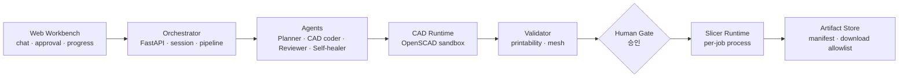

# Model Forge

> **AI-assisted 3D printing workflow orchestration prototype** — 자연어/레시피 기반 CAD 생성, 검증, 사용자 승인, 슬라이싱, 아티팩트 추적을 하나의 typed workflow로 연결하는 방법을 탐색하는 기술 프로토타입입니다.

*(공개 포트폴리오용 큐레이션 판입니다. 상용화·수익·특정 회사·장비 관련 서술은 의도적으로 제외했습니다.)*

**한눈에 보는 결과**

| 항목 | 내용 |
|---|---|
| 검증된 E2E 흐름 | UI 요청 → CAD(OpenSCAD) 생성 → 검증 → 승인 → 슬라이싱 → STL/3MF/G-code + manifest 다운로드 |
| 파이프라인 통제 | 사람 승인 게이트(go/no-go) + fail-fast (runtime 미설정 시 mock silent fallback 금지) |
| 아티팩트 계약 | manifest 기반 추적 + 다운로드 allowlist (path traversal 방지 경계 문서화) |
| 구조 | FastAPI orchestrator + Next.js workbench, 역할별 Agent(Planner·CAD coder·Reviewer·Self-healer) |
| 교체 가능 경계 | LLM / CAD / validator / slicer가 adapter + factory + typed schema로 분리 |
| 격리 실행 | OpenSCAD·slicer runtime을 Docker sandbox 외부 의존성으로 관리 (바이너리 vendoring 없음) |

## 왜 만들었나

"LLM이 CAD 코드를 생성한다"까지는 쉽습니다. 어려운 것은 그 출력이 **실제 프린트 가능한 산출물**이 되기까지의
검증·승인·추적 경계를 설계하는 일입니다. Model Forge는 생성 결과를 그대로 신뢰하지 않고,
validation 노드와 사람 승인 게이트를 통과한 것만 슬라이서로 넘기는 **통제된 파이프라인**을 프로토타입으로 검증합니다.

## 아키텍처

계층 간 결합은 공개 REST/WebSocket 계약과 typed schema로만 — 특정 벤더 runtime은 adapter 뒤에 숨습니다.

## 개발 프로세스 — AI 개발 스위트(MAM)의 실증 프로젝트

이 리포는 직접 설계한 **AI 개발 스위트 [MultiAgent_Monorepo](https://github.com/SangHun-Kimvalue/MultiAgent_Monorepo)**
(방법론 캐논 + ztr 기계 검사 런타임 + ACP 관제)의 반자율 개발 프로세스로 만들어지고 있습니다.
안쪽 루프(구현→리뷰→기계 검사)는 무인으로 돌고, 페이즈 경계(설계 승인·커밋·다음 페이즈)는 사람이 go/no-go를 결정합니다.
스위트가 "방법론 문서"에 머물지 않고 실제 프로젝트를 완주시킬 수 있는지를 검증하는 실증 사례이며,
구현-기계검사-테스트-리뷰 무인 사이클에서 독립 리뷰 게이트가 실결함을 적발하는 것까지 확인했습니다.

## 엔지니어링에서 배운 것 (문서화된 리스크 기준)

- Long-lived slicer 프로세스의 반복 호출 블로커를 확인하고 **per-job supervised process** 경로로 우회 검증
- RCE·silent fallback·artifact path traversal·runtime version drift를 리스크 레지스터로 관리
- AGPL/GPL 계열 runtime의 배포 경계를 ADR로 추적 (바이너리 미포함 원칙)

## 상태

기술 실현 가능성을 검증하는 프로토타입 단계입니다. 자연어 prompt → CAD 품질의 통계적 검증과
상용 control plane(계정·과금 등)은 범위 밖입니다.

## 기술 스택

TypeScript(Next.js) · Python(FastAPI) · OpenSCAD · Docker sandbox · pnpm monorepo · WebSocket · typed schema 계약
